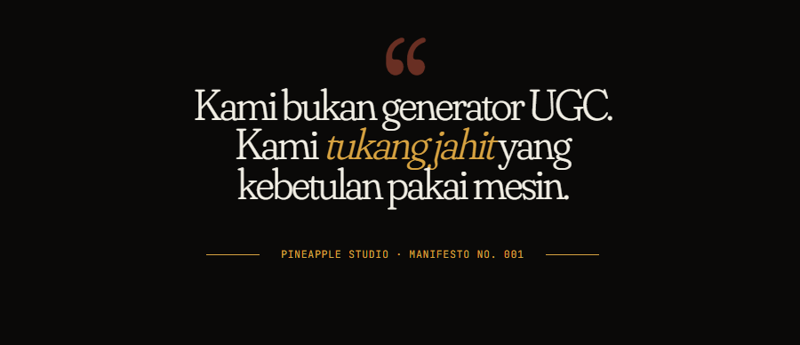

<div align="center">

# PromptCraft UGC



**Generator prompt video UGC untuk TikTok/Reels dari sekadar link produk Shopee.**

Tempel link, pilih kualitas model AI, dan pipeline 8 langkah menghasilkan analisis produk, hook viral, gambar UGC, sampai prompt video 2-klip siap pakai untuk Veo3/image-to-video.

<p>
  
  
  
  
  
  
</p>

</div>

---

## Fitur

- **Scraper Shopee** — ambil nama, deskripsi, kategori, harga, rating, dan gambar produk via Shopee API (fallback ke parsing meta tag HTML).
- **Pipeline AI 8 langkah** — dari analisis produk hingga script video lengkap.
- **Multi-tier kualitas** — pilih `budget` / `balanced` / `premium`, masing-masing memetakan model berbeda per langkah (lihat `lib/openrouter.ts`).
- **Dua provider gambar** — Leonardo (Nano Banana, multi-ref dengan kontrol strength) atau OpenRouter (Gemini image models, single/multi-ref).
- **Reference video frames** — upload video referensi, frame diekstrak di sisi klien lalu dikirim ke analisis.
- **Streaming pipeline** — langkah analyze → creative+hooks dijalankan via SSE (`EventSource`) untuk update real-time.
- **Preset model & background** — karakter dan latar dari Supabase Storage (`lib/models.ts`).

---

## Stack

- **Next.js 16** (App Router) + **React 19**
- **TypeScript 5.7**
- **Tailwind CSS 4** + **Radix UI** + **shadcn/ui**
- **OpenAI SDK** sebagai klien, di-route ke **OpenRouter** (`baseURL: https://openrouter.ai/api/v1`)
- **Leonardo.ai** untuk generasi gambar (opsional)
- **Vercel Analytics**

## Prasyarat

- Node.js 18+ (rekomendasi 20+)
- **OpenRouter API key** — wajib, dipakai semua langkah teks/analisis
- **Leonardo API key** — opsional, hanya jika provider gambar di-set ke Leonardo

API key dimasukkan lewat halaman **Settings** di aplikasi dan disimpan di `localStorage` (bukan di file env).

## Menjalankan

```bash
npm install
npm run dev
```

Buka [http://localhost:3000](http://localhost:3000).

Script lain:

```bash
npm run build   # production build
npm run start   # jalankan hasil build
npm run lint    # eslint
```

## Cara Pakai

1. Buka **Settings**, isi OpenRouter API key (dan Leonardo key bila perlu), pilih quality tier serta provider gambar.
2. Masuk ke **Dashboard → New Task**.
3. Tempel link produk Shopee. Opsional: pilih preset model/background, atau upload video referensi.
4. Jalankan pipeline. Setiap langkah tampil real-time; hasil akhir berupa prompt video 2-klip siap salin.

## Catatan

- **Tanpa autentikasi.** Aplikasi tidak punya login; API key disimpan di browser pengguna. Jangan deploy sebagai layanan publik bersama tanpa menambah lapisan auth — key bisa terekspos antar pengguna bila localStorage dibagikan.
- Preset model/background di `lib/models.ts` menunjuk ke bucket Supabase tertentu. Ganti URL dengan bucket sendiri bila perlu.
- Endpoint AI berjalan dengan `maxDuration` 60–120 detik; sesuaikan limit platform deploy (mis. Vercel) sesuai paket.
